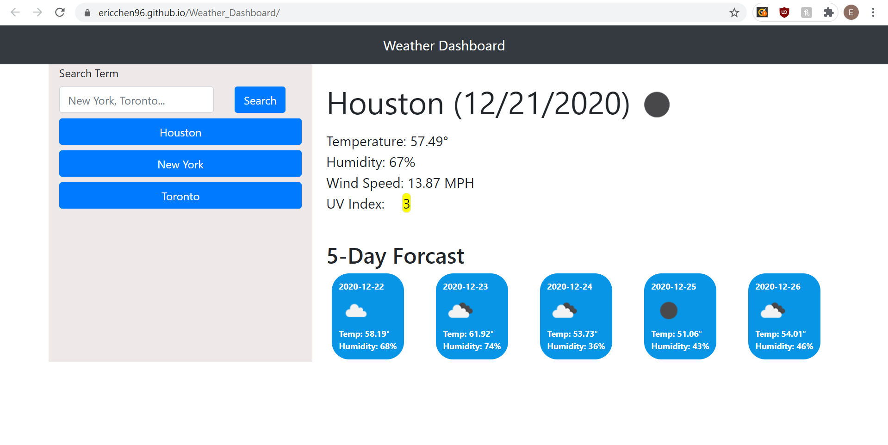

# Weather_Dashboard

[Link to site](https://ericchen96.github.io/Weather_Dashboard/)  
[Link to Github repository](https://github.com/EricChen96/Weather_Dashboard)

## Installation

Go to Github and download

## Description

The following code quiz would create a weather dashboard that shows the current weather and 5 day forcast for a city.

It'll save the user's searched cities and create buttons with their searched cities. It'll also record their last searched city and display it even if the user reloads the page.

